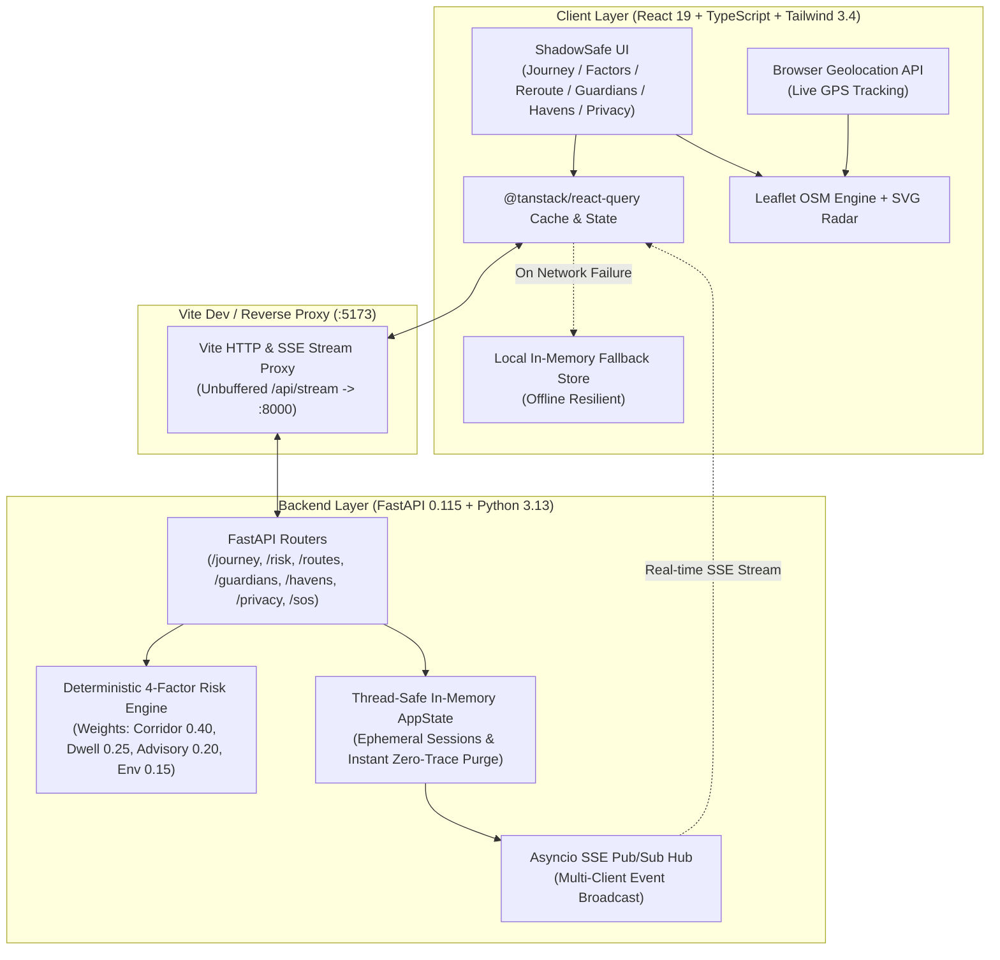

# ShadowSafe 2.0 🛡️
### Zero-Knowledge Autonomous Journey Safety & Safe Corridor Routing Platform
**IEEE Women in Engineering (WIE) ILS 2026 Hackathon Demo Entry**

---

## 🌟 Executive Overview
**ShadowSafe 2.0** is an explainable personal safety platform that pairs privacy-preserving real-time transit telemetry with algorithmic risk scoring, safe haven diversion networks, and peer-to-peer guardian circles. 

Unlike traditional panic-button trackers that continuously stream raw GPS to commercial ad-brokers, ShadowSafe operates on a **Zero-Knowledge Architecture**:
- **RAM-Only In-Memory State**: Telemetry, coordinate caches, and sensor streams are kept in volatile memory and purged on session termination.
- **Explainable Multi-Sensor Risk Radar**: Transparent 4-factor scoring (Corridor Compliance, Dwell/Stop Anomalies, Corroborated Civic Advisories, Environmental Trust Index).
- **Dual Engine Navigation**: Switch seamlessly between the stylized high-contrast SVG Tactical Radar and real-world **Leaflet OpenStreetMap** with live device GPS geolocation tracking (`navigator.geolocation`).
- **Dynamic Multi-City Corridors**: Select pre-calibrated metro routes (San Francisco, New York City, London, Bengaluru, Tokyo) or enter custom route origins/destinations to instantly recalculate distances, ETAs, and risk factors.
- **Offline / Network Fault Resilience**: Transparent client-side fallback store keeps all 6 screens, interactive mutations, and scenario simulations operational even if the FastAPI backend is temporarily offline.

---

## 🏗️ Architecture & Data Flow



---

## 🚀 One-Command Launch

### Prerequisites
- **Node.js**: v18.0+ (v20+ recommended)
- **Python**: 3.10+ (tested on Python 3.13)
- **Git**

### Installation & Quick Start

1. **Clone & Navigate to Workspace:**
   ```bash
   git clone <repo-url>
   cd shadowsafe
   ```

2. **Backend Virtual Environment Setup:**
   - **Windows:**
     ```powershell
     python -m venv .venv
     .venv\Scripts\pip install -r backend/requirements.txt
     ```
   - **macOS / Linux:**
     ```bash
     python3 -m venv .venv
     source .venv/bin/activate
     pip install -r backend/requirements.txt
     ```

3. **Frontend Dependencies Setup:**
   ```bash
   cd frontend
   npm install
   cd ..
   ```

4. **Launch Everything with One Command:**
   ```bash
   npm run dev
   ```
   *This initiates `scripts/dev.mjs`, which orchestrates both the FastAPI uvicorn daemon (`:8000`) and the Vite development server (`:5173`) with color-prefixed live logging, graceful shutdown on `Ctrl+C`, and automatic LAN detection for mobile devices.*

---

## 📱 Mobile Device Testing Over Wi-Fi
To test the real GPS tracking and tactile slider experience on a physical smartphone:
1. Ensure your smartphone is connected to the same Wi-Fi network as your host computer.
2. Note the **LAN URL** output in your terminal by `npm run dev` (e.g., `http://192.168.1.150:5173`).
3. Open the URL in Safari (iOS) or Chrome (Android).
4. Tap **"Enable GPS Tracking"** on the `/journey` Leaflet map to grant location permissions and view real-time location markers.
> *Note on Windows Firewall: If your phone cannot connect, verify that inbound traffic on port 5173 is permitted in Windows Defender Firewall.*

---

## ⚖️ Jury Demo Script (IEEE WIE ILS 2026)

This comprehensive validation script verifies the platform's nominal, anomalous, and fail-safe operational capabilities:

| Step | Action | Expected Behavior |
| :--- | :--- | :--- |
| **1. Journey Monitor** | Open `http://localhost:5173/journey` | Risk score displays **38** with amber badge **"Moderate Attention"**. Alert banner displays *"Bus turned onto unlit 7th St"*. |
| **2. Dynamic City / Route** | Click the location badge (`Montgomery St Metro`) | Corridor selector modal opens. Switch to **Bengaluru, IN (Koramangala -> Indiranagar)** or **New York City**. Distance, ETA, and corridor indicators update across all metrics. |
| **3. Real Leaflet Map & GPS** | Click the map toggle button (top-right of map) | Switches from Tactical Radar SVG to interactive Dark CartoDB OpenStreetMap. Click *"Enable GPS"* to track real movement. |
| **4. Explainable Factors** | Tap **"See Why (38)"** or navigate to `/factors` | Displays 4 breakdown determinants: Corridor Compliance (+18 pts), Dwell Anomaly (+9 pts), Corroborated Reports (+7 pts), Environment (+4 pts). Confidence gauges show 94% / 88%. Engine chip shows live relative seconds (`Evaluated Ns ago`). |
| **5. Safe Reroute Simulation** | Tap **"Simulate Reroute"** on `/factors` | Toast notifies: *"Reroute simulation complete — no state changed"*. Navigate to `/reroute`. Route B (Concern 8/100) is pre-selected. Tap **"Accept Safe Corridor"** -> redirects to `/journey` with score reduced to **14** (Safe). |
| **6. Multi-Tab Real-time Sync** | Open `/privacy` in Tab 1 and `/journey` in Tab 2 | Click **"Run Next Simulated Anomaly"** in Tab 1: cycle through stages `1 (12)` -> `2 (38)` -> `3 (67)` -> `4 (89)` -> `5 (14)`. Tab 2 updates in real-time within < 1 second via Server-Sent Events (SSE). |
| **7. Zero-Knowledge Policy** | On `/privacy`, toggle **"Anonymized Incident Crowdsourcing"** OFF | The composite score recalculates without civic telemetry noise, dropping by 3 points with transparent explanation. |
| **8. SOS Slider & Stand Down** | Go to `/guardians`. Drag **"Slide to Trigger SOS"** thumb past 92% | Audible vibration & 5-second countdown timer initiates with server-synchronized deadline. Click **"Cancel (5s)"** to abort. Re-slide and let timer expire -> Red alert bar appears globally on all pages. Click **"Stand Down"** to resolve. |
| **9. Safe Haven Sanctuary** | Go to `/havens`. Filter by **"Medical (2)"** | Map pins filter to medical sanctuaries. Click **"Flash / Sound Beacon"** -> Displays notification confirmation. Click **"Notify Circle"** to inform emergency guardians. |
| **10. Zero-Trace Purge** | Go to `/privacy`. Click **"Purge Coordinate Cache"** | Button displays *"Purging Session..."* for 600ms, then *"Session Cache Cleared (0 Bytes)"* for 2.5s. Click **"Reset demo"** to return system to boot stage 2. |

---

## 🧪 Quality Gates & Automated Verification

Run all test suites and production builds with standard npm commands:

```bash
# Run all unit, integration, and cross-screen consistency tests
npm test

# Run isolated FastAPI test suite (12 tests)
npm run test:backend

# Run cross-screen data consistency verification (25 multi-stage checks)
npm run test:consistency

# TypeScript strict type checking
npm run typecheck

# Code quality & linter checks
npm run lint

# Production bundle compilation
npm run build
```

---

## 📑 API Contract Overview

The FastAPI backend exposes standard REST and SSE endpoints as documented in `docs/API_CONTRACT.md`:

| Method | Endpoint | Description |
| :--- | :--- | :--- |
| `GET` | `/api/health` | Uptime, system health, and scoring engine version. |
| `GET` | `/api/journey` | Composite journey telemetry, vehicle kinematics, risk HUD, and active alerts. |
| `POST` | `/api/journey/corridor` | Dynamic corridor origin/destination update for multi-city routing. |
| `GET` | `/api/risk` | 4-factor risk breakdown, driver shares, and algorithmic audit logs. |
| `GET` | `/api/routes` | Alternative corridors with concern scores and advantage metrics. |
| `POST` | `/api/routes/select` | Optimistic selection of active corridor alternative. |
| `POST` | `/api/routes/accept` | Commits safe corridor and resets trip deviation. |
| `GET` | `/api/guardians` | Guardian circle members, battery status, and direct emergency contacts. |
| `POST` | `/api/guardians` | Add personal guardian contact with phone number validation. |
| `DELETE` | `/api/guardians/{id}`| Remove personal guardian. |
| `POST` | `/api/sos/arm` | Arms SOS state machine with 5-second grace countdown. |
| `POST` | `/api/sos/cancel` | Aborts pending SOS countdown. |
| `POST` | `/api/sos/resolve` | Stands down dispatched SOS broadcast. |
| `GET` | `/api/havens` | Sanctuary mesh directory with category filtering and proximity ranking. |
| `POST` | `/api/havens/{id}/beacon` | Triggers acoustic/optical haven beacon. |
| `GET` | `/api/privacy` | Ephemeral session metrics, RAM storage confirmation, and policy toggles. |
| `POST` | `/api/privacy/purge` | Instantly purges all telemetry, coordinate buffers, and share links from RAM. |
| `GET` | `/api/stream` | Server-Sent Events (SSE) live push stream for reactive multi-screen updates. |

---

## 🛠️ Troubleshooting & Frequently Asked Questions

| Symptom | Cause | Resolution |
| :--- | :--- | :--- |
| **"Local Mode: Offline Fallback" banner appears** | FastAPI backend is not running on port 8000. | Start the backend via `npm run dev` or run `uvicorn app.main:app --port 8000` inside `backend/`. The app remains fully functional in local fallback mode. |
| **CORS errors on LAN / Mobile** | Backend CORS origin list missing LAN IP. | Backend CORS is configured with `allow_origins=["*"]` by default. Check `backend/.env` if overridden. |
| **Map tiles not loading** | Device has no internet connection. | Leaflet map falls back cleanly to the offline-ready SVG Radar component. Switch via the top-right map button. |
| **Port 5173 or 8000 already in use** | A previous instance was not terminated. | Terminate lingering processes (`taskkill /F /IM python.exe` on Windows or `killall uvicorn` on Unix). |

---

## ⚖️ Known Hackathon Scope Notes
- **Simulated Emergency Services**: The SOS broadcast communicates with simulated emergency endpoints and dispatches toasts; no real 911 calls are placed.
- **SMS/Carrier Notifications**: Circle notifications and haven diversion alerts are simulated via toast messaging and verified in the audit stream.
- **Single Demo Session**: AppState maintains an in-memory session designed for demo scenarios and jury evaluation.

---
*Developed for IEEE WIE ILS 2026. Built with React 19, TypeScript, Tailwind CSS, Leaflet, and FastAPI.*
